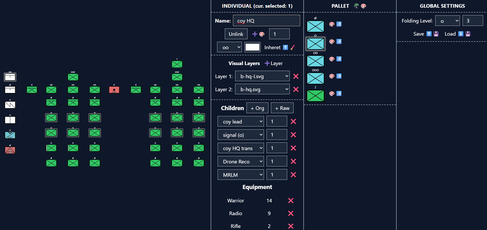

# Editor that allows to create an Order of Battle (Military unit structure), and focuses on flowing user expierience
# [Check it out!!](https://konradschmidt0.github.io/military-unit-maker/)

[Check the official Trello!](https://trello.com/b/UTt0xWVR/military-unit-maker)

## Main Goals:
 - Making creating an OoB as easy as drawing on a paper, while retaining all the automatic spacing, reusability, editability and automation of virtual editor
 - Official NATO unit icons, but various 'dialects' (Official, Niehorster, Original)
 - Automatic Table of Equipment summing

Most of the icons are made by one and only [Battle Order](https://www.battleorder.org/icons) 🙏